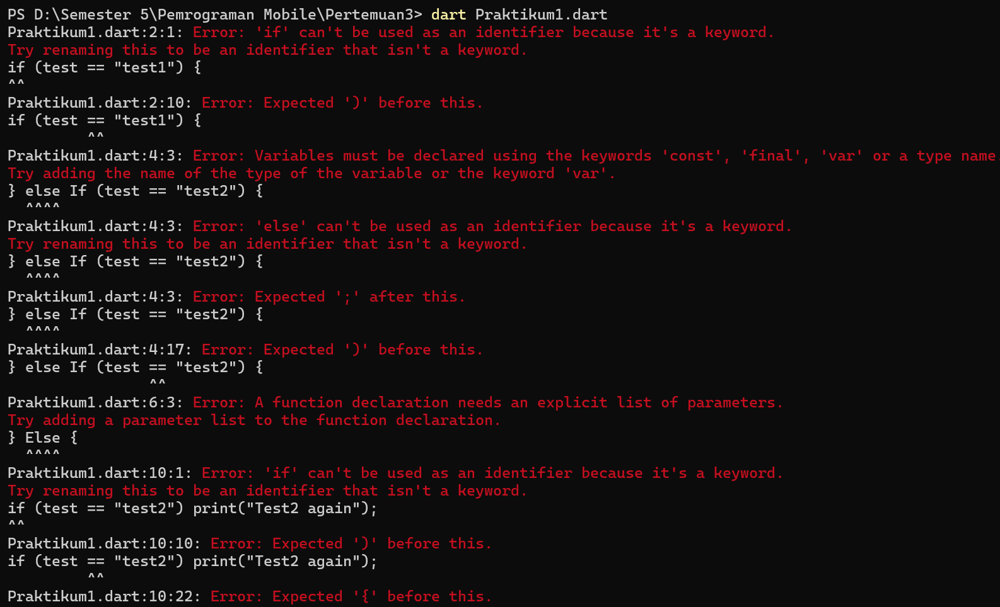
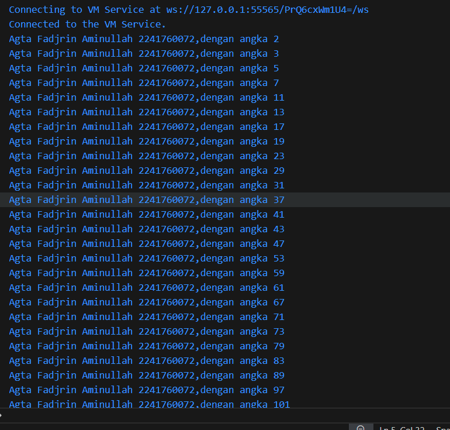

# Jobsheet 3
### Nama : Agta Fadjrin Aminullah
### Kelas / No : SIB 3E / 03
### NIM : 2241760072

## Praktikum 1: Menerapkan Control Flows ("if/else")

Selesaikan langkah-langkah praktikum berikut ini menggunakan DartPad di browser Anda.

#### Langkah 1:

#### Langkah 2:

Silakan coba eksekusi (Run) kode pada langkah 1 tersebut. Apa yang terjadi? Jelaskan!

= Menurut saya kesalahan tersebur terjadi karena penggunakan kapital if maupun if else yang seharusnya huruf kecil menjadi huruf besar.

#### Langkah 3:

Tambahkan kode program berikut, lalu coba eksekusi (Run) kode Anda.

#### Perbaikan Code :

Apa yang terjadi ? Jika terjadi error, silakan perbaiki namun tetap menggunakan if/else.

= Terjadinya inkonsistensi huruf, langkah yang saya ambil adalah memperbaiki permasalahan huruf kapital, inisiasi dari variable, lalu saya menambahkan else dari program karena ditakutkan ada sesuatu yang keluar dari rule yang mengharuskan penggunaan else, lalu tidak adanya suatu yang bisa dibandingkan kebenaran dari nilainya.

## Praktikum 2: Menerapkan Perulangan "while" dan "do-while"

#### Langkah 1:

Ketik atau salin kode program berikut ke dalam fungsi main().

#### Langkah 2:

Silakan coba eksekusi (Run) kode pada langkah 1 tersebut. Apa yang terjadi? Jelaskan! Lalu perbaiki jika terjadi error.

= Tidak adanya inisiasi suatu variable, maka dari itu saya menginisiasi variable tersebut (perbaikan terjadi sekaligus di langkah berikutnya).

#### Langkah 3:

Tambahkan kode program berikut, lalu coba eksekusi (Run) kode Anda.

Apa yang terjadi ? Jika terjadi error, silakan perbaiki namun tetap menggunakan do-while.

= Sama seperti penjelasan sebelumnya, yaitu tidak adanya inisiasi suatu variable.

## Praktikum 3: Menerapkan Perulangan "for" dan "break-continue"

Langkah 1:

Langkah 2:

Silakan coba eksekusi (Run) kode pada langkah 1 tersebut. Apa yang terjadi? Jelaskan! Lalu perbaiki jika terjadi error.

= Error, karena tidak adanya pendeklarasian variable yang bernama index, perubahan atau perbaikan code akan saya lakukan di langkah berikutnya.

Langkah 3:

Apa yang terjadi ? Jika terjadi error, silakan perbaiki namun tetap menggunakan for dan break-continue.

= Error, karena tidak adanya pendeklarasian variable yang bernama index, Penggunaan huruf if maupun else if yang salah seharusnya menggunakan huruf kecil bukan kapital, lalu pemberian operator atau increment decrement tidak ada sebelumnya, perbaikan code sudah saya lakukan di langkah ini.

## Tugas Praktikum

Buatlah sebuah program yang dapat menampilkan bilangan prima dari angka 0 sampai 201 menggunakan Dart. Ketika bilangan prima ditemukan, maka tampilkan nama lengkap dan NIM Anda.

= Pada gambar ini, mencetak nama saya sesuai dengan bilangan prima yaitu "Agta Fadjrin Aminullah 2241760072" ditambah dengan kalimat "dengan angka" agar dapat membuktikan bahwa hasil dari code tersbut juga bilangan prima.