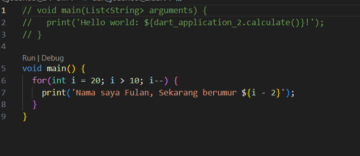
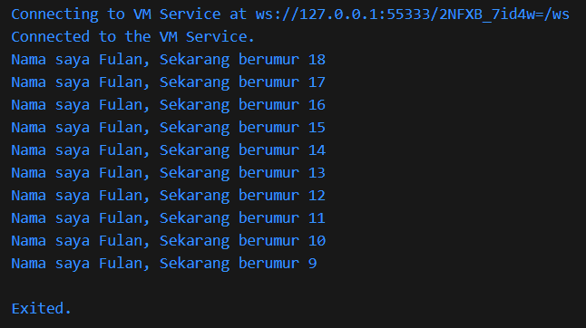

# LAPORAN JOBSHEET 2
## PEMROGRAMAN MOBILE

Agta Fadjrin Aminullah
3E / Sistem Informasi Bisnis
2241760072 / 03

PROGRAM STUDI D-IV SISTEM INFORMASI BISNIS JURUSAN TEKNOLOGI INFORMASI
POLITEKNIK NEGERI MALANG 2024

## Tugas Praktikum

1.	Modifikasilah kode pada baris 3 di VS Code atau Editor Code favorit Anda berikut ini agar mendapatkan keluaran (output) sesuai yang diminta!

2. Mengapa sangat penting untuk memahami bahasa pemrograman Dart sebelum kita menggunakan framework Flutter ? Jelaskan!

= Karena semua pengembangan framework Flutter melibatkan pengetahuan/fitur mendalam dengan bahasa Dart, kode aplikasi, kode plugin, dan manajemen dependensi semuanya menggunakan bahasa Dart beserta fitur-fiturnya. Jadi ketika kita memahami bahasa dart akan memudahkan kita untuk meanjadi produktif dengan flutter dan aakan membuat anda merasa nyaman dalam pengembangan Flutter.

3. Rangkumlah materi dari codelab ini menjadi poin-poin penting yang dapat Anda gunakan untuk membantu proses pengembangan aplikasi mobile menggunakan framework Flutter.

= Dart adalah bahasa pemrograman yang menggabungkan kelebihan bahasa tingkat tinggi dengan fitur modern seperti alat produktivitas, garbage collection, anotasi tipe opsional, tipe statis, dan portabilitas. Dart mendukung dua mode eksekusi kode: Just-In-Time (JIT) dan Ahead-Of-Time (AOT). Kompilasi JIT mengkompilasi kode sumber saat diperlukan, berguna untuk pengembangan dengan fitur debugging dan hot reload. Sementara itu, kompilasi AOT mengompilasi kode sebelumnya dan memberikan performa lebih baik, meskipun fitur debugging tidak tersedia.
Dart menggunakan fungsi dan metode untuk memisahkan kode. Fungsi utama main() adalah titik awal eksekusi aplikasi Dart. Struktur dasar fungsi main() terdiri dari:
•	void: Menunjukkan fungsi tidak mengembalikan data.
•	main: Nama fungsi utama yang dicari oleh Dart VM.
•	(): Menandakan fungsi ini tidak menerima parameter.
•	{}: Menandai awal dan akhir blok kode.

