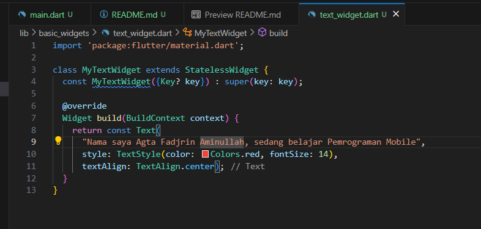

# pertemuan5

A new Flutter project.

## Praktikum 4

### Langkah 1: Text Widget

Buat folder baru basic_widgets di dalam folder lib. Kemudian buat file baru di dalam basic_widgets dengan nama text_widget.dart. Ketik atau salin kode program berikut ke project hello_world Anda pada file text_widget.dart.

Lakukan import file text_widget.dart ke main.dart, lalu ganti bagian text widget dengan kode di atas. Maka hasilnya seperti gambar berikut. Screenshot hasil milik Anda, lalu dibuat laporan pada file README.md.

### Langkah 2: Image Widget

Buat sebuah file image_widget.dart di dalam folder basic_widgets dengan isi kode berikut.

Jangan lupa sesuaikan kode dan import di file main.dart kemudian akan tampil gambar seperti berikut.

## Praktikum 5: Menerapkan Widget Material Design dan iOS Cupertino

### Langkah 1: Cupertino Button dan Loading Bar

Buat file di basic_widgets > loading_cupertino.dart. Import stateless widget dari material dan cupertino. Lalu isi kode di dalam method Widget build adalah sebagai berikut.

